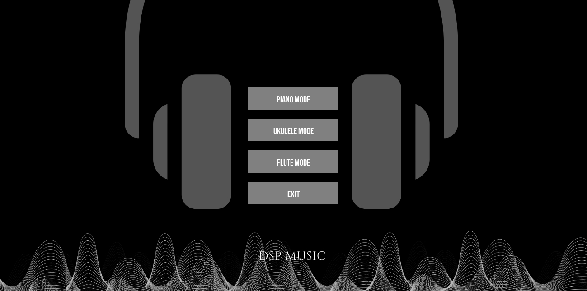

# Music Generator

  
*Một trình giả lập âm nhạc đa năng cho Piano, Ukulele và Flute, được xây dựng bằng Python và Pygame.*

---

## Giới thiệu

**Music Generator** là một ứng dụng mô phỏng chơi nhạc độc đáo, cho phép người dùng chơi và sáng tạo âm nhạc với ba loại nhạc cụ: Piano, Ukulele và Flute. Dự án kết hợp giao diện đồ họa trực quan (Pygame) với xử lý âm thanh mạnh mẽ (Librosa, SoundDevice), mang đến trải nghiệm tương tác mượt mà và thú vị. Người dùng có thể nhập các tệp nốt nhạc, điều chỉnh tempo, xuất file WAV, và thậm chí chơi trực tiếp trên bàn phím ảo.

Dự án được thiết kế với mục tiêu giáo dục và giải trí, phù hợp cho những người yêu âm nhạc, lập trình viên muốn khám phá xử lý âm thanh, hoặc bất kỳ ai tò mò về cách mô phỏng nhạc cụ hoạt động.

---

## Tính năng nổi bật

- **Ba chế độ nhạc cụ**:
  - **Piano**: Mô phỏng bàn phím piano với 52 phím trắng và 36 phím đen, hỗ trợ chơi trực tiếp bằng chuột hoặc bàn phím.
  - **Ukulele**: Hiển thị bảng hợp âm trực quan, chơi các hợp âm phổ biến bằng phím tắt.
  - **Flute**: Mô phỏng các lỗ bấm trên sáo, phát âm thanh theo nốt nhạc.

- **Quản lý âm nhạc**:
  - Nhập tệp `.txt` chứa danh sách nốt nhạc để phát tự động.
  - Điều chỉnh tốc độ phát (tempo) với các nút "Faster" và "Slower".
  - Xuất bản nhạc đã tạo thành file `.wav`.

- **Giao diện người dùng**:
  - Menu khởi động thân thiện với các tùy chọn chế độ.
  - Các nút điều khiển (Play/Pause, Reset, Export, Exit) được căn chỉnh đẹp mắt.
  - Hỗ trợ thoát chương trình từ cả Start Menu và giao diện chính.

- **Hiệu ứng âm thanh**: Áp dụng hiệu ứng (qua `audio_effects.py`) để tăng chất lượng âm thanh.

---

## Cài đặt

### Yêu cầu
- **Python**: 3.8 hoặc cao hơn
- **Hệ điều hành**: Windows, macOS, hoặc Linux
- **Thư viện cần thiết**:
  - `pygame` - Giao diện đồ họa và phát âm thanh cơ bản.
  - `librosa` - Xử lý và tải tệp âm thanh.
  - `numpy` - Tính toán tín hiệu âm thanh.
  - `sounddevice` - Phát âm thanh thời gian thực.
  - `scipy` - Xuất file WAV.
  - `easygui` - Hộp thoại chọn/lưu file đơn giản.

### Hướng dẫn cài đặt
1. **Sao chép dự án**:
   ```bash
   git clone https://github.com/Kienk66-it/Music_Generator.git
   cd Music_Generator
   ```

2. **Tạo môi trường ảo (khuyến nghị)**:
   ```bash
   python -m venv venv
   source venv/bin/activate  # Linux/macOS
   venv\Scripts\activate     # Windows
   ```

3. **Cài đặt thư viện**:
   ```bash
   pip install -r requirements.txt
   ```
   Nếu không có file `requirements.txt`, cài đặt từng thư viện:
   ```bash
   pip install pygame librosa numpy sounddevice scipy easygui
   ```

4. **Tải tài nguyên**:
   - Đảm bảo các thư mục `BackGround/`, `Tracks/`, `Fonts/`, và `notes/` chứa đầy đủ hình ảnh nền, tệp âm thanh và font chữ (xem [Cấu trúc thư mục](#cấu-trúc-thư-mục)).

---

## Cách sử dụng

1. **Khởi động chương trình**:
   ```bash
   python main.py
   ```

2. **Chọn chế độ**:
   - Từ Start Menu, nhấp vào "Piano Mode", "Ukulele Mode", hoặc "Flute Mode" để bắt đầu.
   - Nhấn "Exit" để thoát ngay từ Start Menu.

3. **Điều khiển**:
   - **Input File**: Nhập tệp `.txt` chứa nốt nhạc (ví dụ: `C4 D4 E4` cho Piano).
   - **Play/Pause**: Phát hoặc tạm dừng bản nhạc.
   - **Reset**: Xóa bản nhạc hiện tại.
   - **Faster/Slower**: Tăng/giảm tốc độ phát.
   - **Export wav file**: Lưu bản nhạc thành file `.wav`.
   - **Exit**: Thoát chương trình từ giao diện chính.
   - **Back to Menu**: Quay lại Start Menu.

4. **Chơi nhạc cụ**:
   - **Piano**: Dùng chuột nhấp vào phím hoặc gõ bàn phím (xem `PIANO_KEYS` và `SHARP_KEYS` trong `main.py`).
   - **Ukulele**: Gõ phím tắt để chơi hợp âm (xem `KEY_TO_CHORD`).
   - **Flute**: Gõ phím để chơi nốt (xem `FLUTE_KEY_MAPPING`).

---

## Cấu trúc thư mục

```
Music_Generator/
├── BackGround/         # Hình ảnh nền
│   ├── 1.jpg           # Flute
│   ├── 2.jpg           # Start Menu
│   ├── 3.jpg           # Ukulele
│   ├── 4.jpg           # Piano
│   └── Giao_dien.png   # Hình ảnh giao diện chính
├── Tracks/             # Tệp âm thanh nhạc cụ
│   ├── piano/          # Âm thanh piano (A0.wav, Bb0.wav, ...)
│   ├── ukelele/        # Âm thanh ukulele (C.wav, D.wav, ...)
│   └── flute/          # Âm thanh flute (do1.wav, re1.wav, ...)
├── Fonts/              # Font chữ
│   └── UTM Bebas.ttf
├── notes/              # Âm thanh phím piano cơ bản
│   ├── C.wav, D.wav, ...
├── audio_effects.py    # Hiệu ứng âm thanh
├── main.py             # File chính chạy chương trình
├── piano_lists.py      # Danh sách nốt piano
├── players.py          # Logic xử lý nhạc cụ
├── ui_elements.py      # Giao diện người dùng
└── README.md           # File này
```

---

## Ví dụ tệp nốt nhạc

Tạo tệp `song.txt` với nội dung sau để nhập vào chương trình:
```
C4 D4 E4
F4 G4 A4
\n  # Dòng trống tạo khoảng nghỉ
B4 C5
```
- Piano: Dùng ký hiệu như `C4`, `Db4`, ...
- Ukulele: Dùng hợp âm như `C`, `Dm`, `G7`, ...
- Flute: Dùng nốt như `C1`, `D2`, `F3`, ...

---

## Đóng góp

Chúng tôi hoan nghênh mọi đóng góp để cải thiện dự án! Để tham gia:
1. Fork kho lưu trữ này.
2. Tạo nhánh mới: `git checkout -b feature/your-feature`.
3. Commit thay đổi: `git commit -m "Thêm tính năng XYZ"`.
4. Push lên nhánh: `git push origin feature/your-feature`.
5. Tạo Pull Request.

---

## Tác giả

- **Lê Trung Kiên** - [21021602@vnu.edu.vn] - [https://github.com/Kienk66-it]

<!-- Dự án được phát triển với sự hỗ trợ từ Grok (xAI), đảm bảo mã nguồn sạch và hiệu quả. -->

---

## Lưu ý

Dự án này được thực hiện cho mục đích học tập trong một môn học tại trường. Bạn có thể sử dụng mã nguồn để tham khảo, học hỏi – vui lòng không sử dụng cho mục đích thương mại.

---

## Lời cảm ơn

Cảm ơn bạn đã quan tâm đến **Music Generator**! Nếu bạn thích dự án này, hãy để lại một ⭐ trên GitHub và chia sẻ với bạn bè. Chúc bạn có những phút giây thư giãn với âm nhạc!

---

## Vấn đề đã biết

- Âm thanh có thể bị trễ nhẹ trên một số hệ điều hành Linux (do xung đột giữa ALSA và PulseAudio).
- Một số file nốt nhạc `.txt` nếu viết sai định dạng có thể gây lỗi chương trình – chưa có kiểm tra định dạng đầu vào.
- Khi chạy trên màn hình độ phân giải thấp (< 1280x720), giao diện có thể hiển thị sai vị trí nút.
- Tính năng xuất file WAV có thể không hoạt động nếu thiếu thư viện `scipy`.

> Chúng tôi đang làm việc để khắc phục các vấn đề trên trong các bản cập nhật tiếp theo.

---

## Kế hoạch phát triển

- [ ] Thêm chế độ trống (Drum Mode) với các âm thanh bộ gõ.
- [ ] Cho phép người dùng ghi lại phần chơi nhạc trực tiếp và lưu thành file MIDI.
- [ ] Cải thiện giao diện: responsive, hỗ trợ dark mode.
- [ ] Thêm tính năng kiểm tra lỗi trong tệp nốt nhập vào.
- [ ] Đưa ứng dụng lên nền web sử dụng Flask hoặc PyScript (nếu khả thi).

> Nếu bạn có ý tưởng hay hoặc muốn đóng góp, đừng ngần ngại tạo một Issue hoặc Pull Request!
